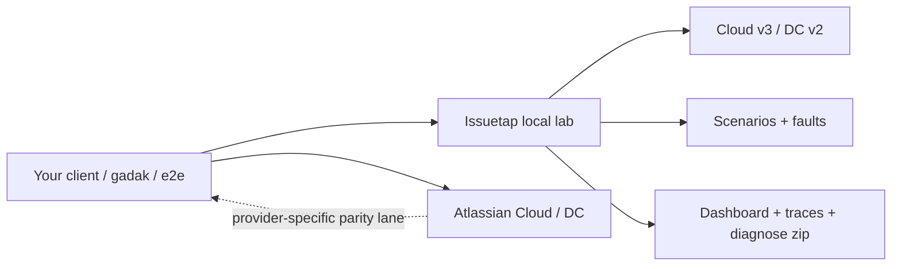

# Issuetap

Local, deterministic Atlassian-compatible server for developing and testing
anything that talks to Jira and Confluence Cloud — plus a dashboard that
shows what the client under test asked for and what it got.

It is **not** an issue tracker. Nobody plans work in it. Issuetap exists so
a client integration can be exercised without a real site.

## What You Get

| Surface | What it is for |
| --- | --- |
| Cloud v3 API | `/rest/api/3/…` with ADF bodies, `POST /search/jql` + `nextPageToken`, `accountId` identities, `/wiki/rest/api/…` with `body.atlas_doc_format`. |
| Data Center v2 read path | `/rest/api/2/…` with wiki-markup bodies, `startAt` search, `username`/`userKey`, Bearer PAT, optional context path. A model, not a verified DC product. |
| Fault scenarios | Credential revoked mid-run, 429 + `Retry-After`, 5xx, delay, malformed JSON, pagination drift. |
| Locales | `--locale ko` (also `ja`, `de`, `en`) serves the same ids with localized status, priority, and issue-type **names**. Clients that key on `"In Progress"` fail immediately. |
| Fixtures | YAML (JSON accepted) for projects, issues, changelog, comments, Confluence spaces and pages. Same fixture + seed → same snapshot. |
| Dashboard | Request log, live graph, last-request diff, scenario faults, diagnostics export. |
| Diagnostics | `issuetap diagnose` writes a zip: traces, snapshot, compatibility table, likely cause. |

## Testing Model



Use two lanes instead of forcing one tool to satisfy every Atlassian test:

- **Fast lane:** issuetap for local development, unit and e2e tests, CI
  regression, fixture setup, fault scenarios.
- **Fallback lane:** a real Atlassian Cloud site (or a real DC instance) for
  provider-specific behaviour and final compatibility checks.

A dialect built from published documentation is still a model. The DC path
makes a Data Center integration *buildable and regression-tested*; it does
**not** make it *verified*. Anyone shipping DC support still needs one real
instance.

For the exact supported surface, see [`docs/COMPATIBILITY.md`](docs/COMPATIBILITY.md).
Known but unimplemented routes return a shaped `unsupported_endpoint` error
(HTTP 501) so a consuming test can tell "issuetap does not cover this yet"
apart from "my client is broken".

## Good Fit / Bad Fit

| Use issuetap when... | Use a real site when... |
| --- | --- |
| You need a deterministic Jira/Confluence for local dev or CI. | You need provider-specific behaviour, permissions, or a board. |
| You want to prove a client keys on ids, not localized names. | You are shipping DC support and need a real DC instance. |
| You need 401 / 429 / truncated-page fault injection. | You need the live site's workflow, apps, or JQL functions. |
| You are writing a client like gadak and want a fixture it can sync. | You are planning work. Issuetap is not an issue tracker. |

## Quick Start

Requirements: Go 1.26+, Node.js 20+.

```bash
npm install
npm run build
go run ./cmd/issuetap serve --fixture examples/fixtures/tiny.yaml
```

Open:

```text
http://127.0.0.1:8080
```

Point a Cloud client at that origin with any Basic `email:token` (or set
`--email` / `--token` to require a specific pair). There is no outbound
network call at runtime.

```bash
curl -s -u you@example.com:issuetap \
  -H 'Accept: application/json' \
  http://127.0.0.1:8080/rest/api/3/myself
```

Korean names, same ids:

```bash
go run ./cmd/issuetap serve --fixture examples/fixtures/tiny.yaml --locale ko
```

Run a scenario (starts an ephemeral server, applies faults, asserts):

```bash
go run ./cmd/issuetap scenario run examples/scenarios/locale-ko-name-trap.yaml
```

## Commands

```text
issuetap serve [--addr] [--fixture] [--locale] [--dialect] [--seed] [--scenario]
issuetap fixtures apply <file>
issuetap fixtures snapshot [--addr host:port] [--format yaml|json]
issuetap scenario run <file> [--report path]
issuetap diagnose [--addr host:port] [--out file.zip]
```

`fixtures apply` loads the file into a throwaway store and prints counts
(it does not change a running `serve`; that is `POST /api/fixtures/apply`).
`fixtures snapshot` prints `GET /api/fixtures/snapshot` from a running server.

## Documentation

- [`docs/CONCEPT.md`](docs/CONCEPT.md) — what it is, and what it is not
- [`docs/ARCHITECTURE.md`](docs/ARCHITECTURE.md) — process shape
- [`docs/COMPATIBILITY.md`](docs/COMPATIBILITY.md) — supported surface
- [`docs/LOCALES.md`](docs/LOCALES.md) — the name-keying trap
- [`docs/SCENARIOS.md`](docs/SCENARIOS.md) — fault files
- [`docs/TESTING.md`](docs/TESTING.md) — how we test, including gadak sync
- [`docs/PRODUCTION_BOUNDARIES.md`](docs/PRODUCTION_BOUNDARIES.md) — do not point production at this
- [`AGENTS.md`](AGENTS.md) — required reading order

## License

Apache-2.0. See `LICENSE` and `NOTICE`.
